# **Retail Profit Decline \- A SQL Case Study**

---

## **What is the objective of the project**

Most portfolio projects are directed towards questions like "what happened" or “why happened” or “what will happen”, for example, the trends observed in the top categories, sales by age group, seasonal fluctuations/prediction. Rather, this project is intended to take a step towards answering questions like **"why did profit margin fall four years in a row, and who/what is responsible?"**

Techniques demonstrated: Joins, conditional aggregation, filtering subqueries, CTEs, window functions.

---

## Part 0: Data Preparation & Cleaning

* **Setting primary keys** where Row ID on retail\_dataset and Date on datetime\_dataset, and re-verified data types for the column. For instance, Decimal for currency fields to avoid floating-point drift in aggregation).  
* **Verified date-time coverage** using ‘LEFT JOIN’ confirmed that there are zero orders that fall outside the date range of the calendar dimension table. This validates it as safe to join on for all time-based analysis.

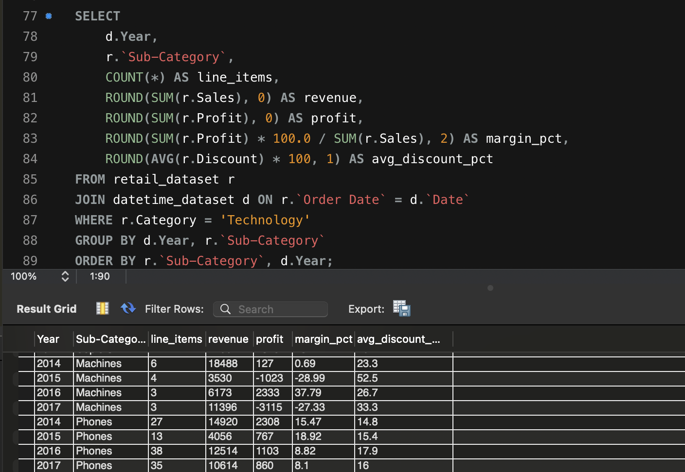

---

## **Part 1: Business Health**

**Query & Output:**

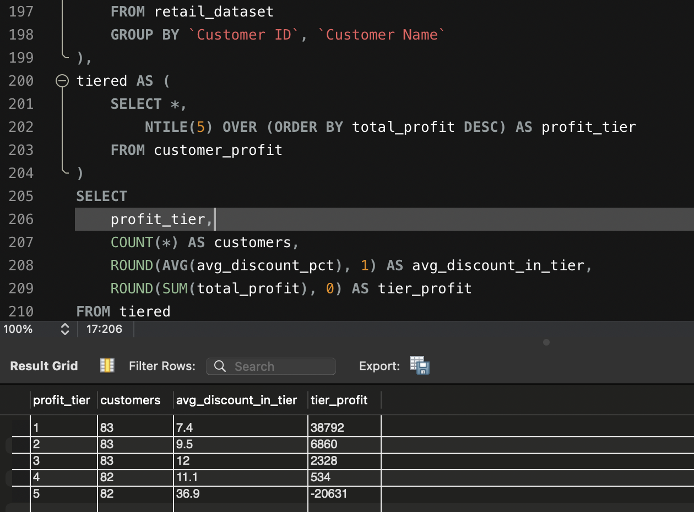

**Question:** Is 2016 an outlier, or part of a seasonal trend, or something else?

A trend observed on the margin percentage that it fell from 10.85% to 6.71% every single year, while the order count grew by 49%, wherein 2016 was an outlier, a four-year straight decline in profits, hidden behind growing order volume.

---

## **Part 2: Cause of Decline**

**Query & Output:**

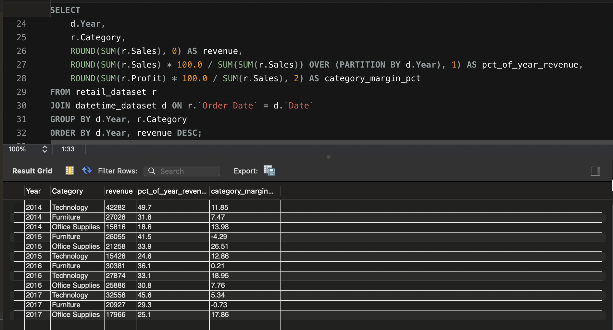

**Question:** If margins are falling, are average discounts increasing as well?

No, the average discount has stayed roughly flat 15-16% throughout the years, and the share of loss-making transactions actually **fell** from 16% in 2014 to 14% in 2017\.

Now, this begs the question, if fewer transactions are bad, then why is the overall margin falling?

**Follow-up Query:**

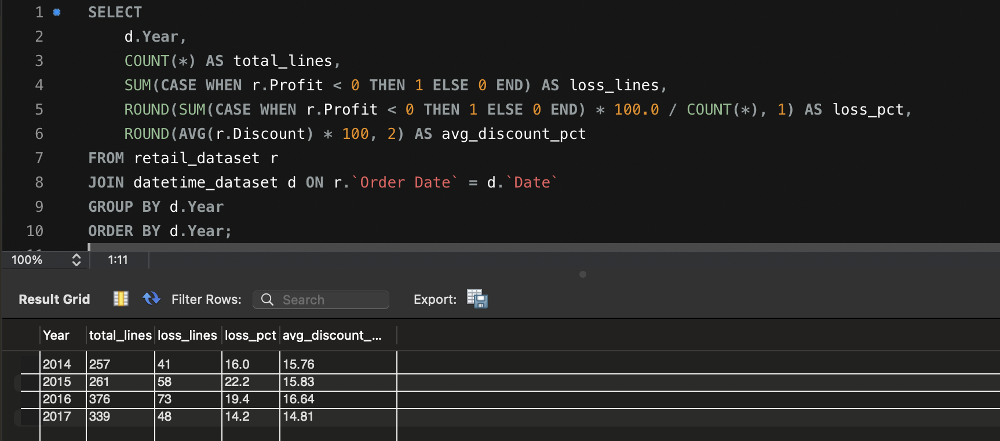

The number of loss transitions have more or less stayed consistent. The average loss per bad line rose,from 113 to 152 in 4 years, and the **single worst loss has more than doubled**, from \-1360 to \-3840. The problem is concentration in the damages, not frequency.

---

## **Part 3: Sector-wise breakdown**

**Query & Output:**

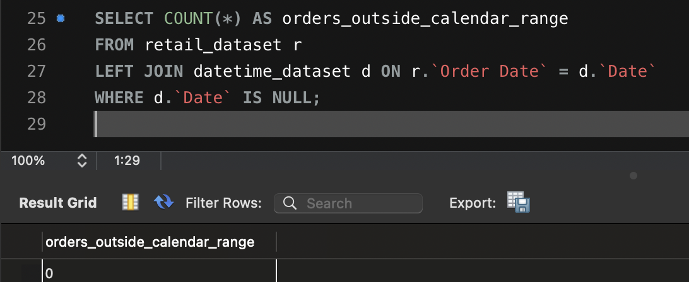

Two separate problems were hiding, which are visible now in the category breakdown. **Technology's margin crashed to 5.34%,** in 2017, **from 12%**, in 2014\. This sector has a consistent share of 45% of the total revenue over the years.

Moreover, furniture had been quietly unprofitable for three straight years and declining in the overall contribution to the revenue share over the years.

**Follow-up Question:** Which specific sub-category inside Technology broke in 2017?

**Query:**

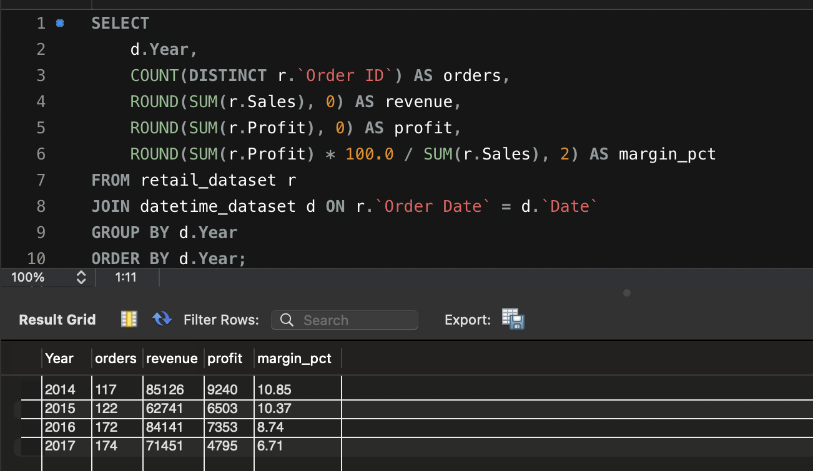

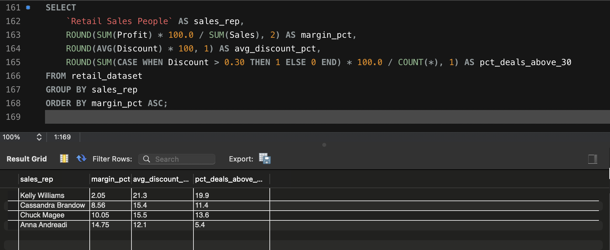

Machines, Phones and Tables were the specific culprits, as the business was losing money and margin (percentage) on the respective items over the years.

---

## **Part 4: Year-Wise and Sector-Wise Breakdown on the Loss Making Categories**

**Query:**

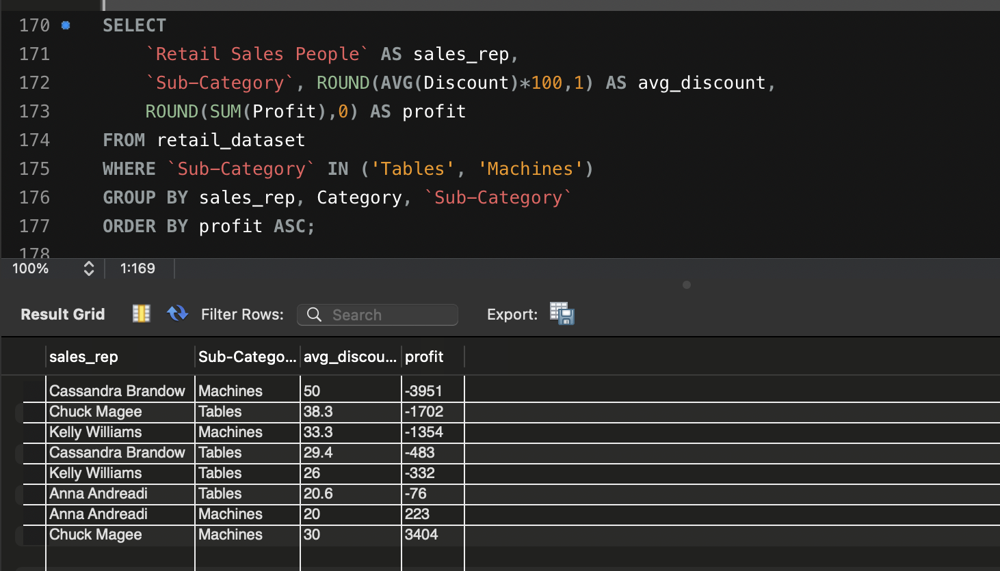

**Question:** Is there a precise discount percentage where each category flips from profit to loss?

For every category, there is a precise discount ceiling, that is, **20% for Furniture, 30% for Technology**. Beyond it, the company loses money on every incremental dollar sold. This turned a vague intuition ("discounting is bad") into a specific, defensible pricing rule.

---

## **Part 5: Are Sales Responsible?**

**Question:** Now that the threshold is known, which sales reps are breaching it?

**Query:**

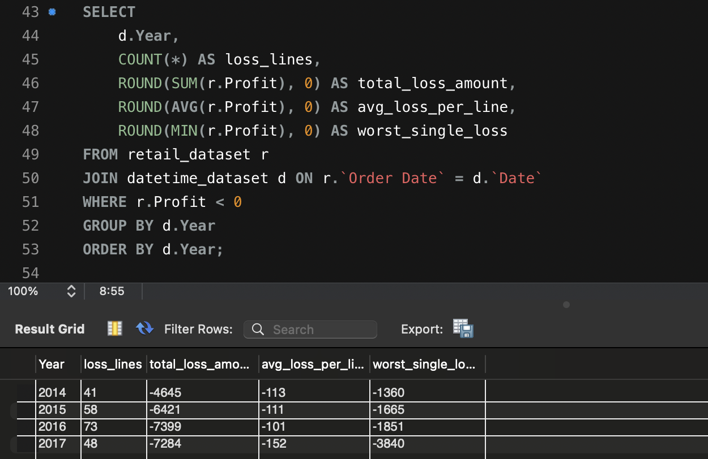

**Kelly Williams** had the worst margin (2.05%) and the highest average discount (21.3%). Anna Andreadi had the best margin (14.75%) at the lowest discount rate (12.1%) 

Even Cassandra Brandow’s performance needs to be analysed as she has worse metrics compared to others of 8% margin percentage for 15% of average discount rate.

**Follow-up Query: Is it the Sales Rep or the category in question**

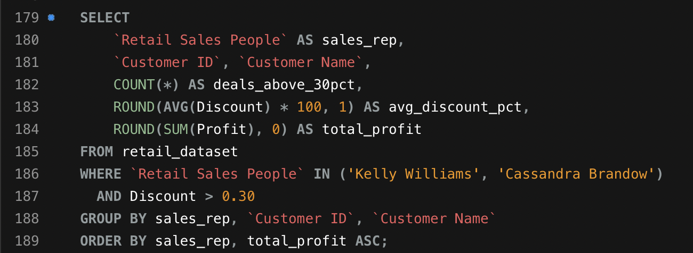

This confirms that the pattern is sales rep-specific, and not market-driven or category-driven \- Kelly's and Cassandra's Tables/Machines deals carried 33–50% discounts and the heaviest losses, while Anna sold the Tables at half the discount and a fraction of the loss.

---

## **Part 6: Could a few powerful customers demanding these discounts?**

**Query:**

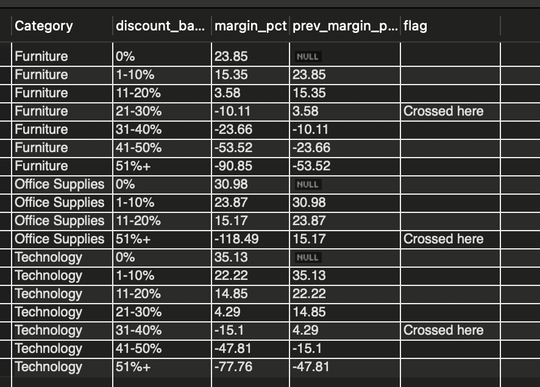

The discounts were scattered across roughly 60 *different*, (mostly) one-time customers. If customers were negotiating hard, the same names would recur across multiple reps, instead the pattern clusters by **rep**, ruling out customer-driven negotiation as the cause.

---

## **Part 7: How much is Customer Value actually at stake?**

**Query:**

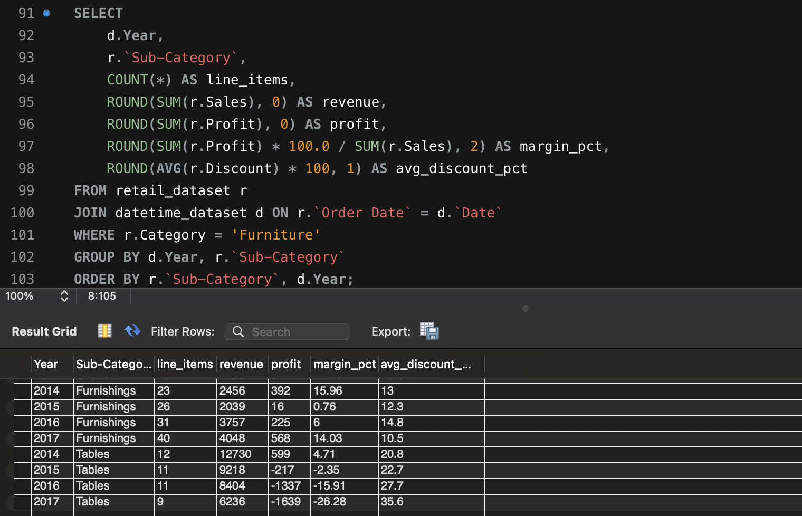

Here, the Tier 1 (top 20% of customers) generated **$38,792** in profit, roughly 139% of total company profit. Tier 5 (bottom 20%) was **net loss-making at \-$20,631**, with an average discount of **36.9%**, nearly five times Tier 1's 7.4%. 

Discount rate and profit move in near-perfect in relation to each other across all five tiers, proving the same mechanism found at the category and rep level holds true all the way down to individual customers.

---

## **Prior Work On the Dataset and Relevant Study**

A few public Jupyter notebooks on this dataset were reviewed before working on this project up – both were EDA-then-machine-learning approach projects, where they attempted to predict the  Profit. They used regression models trained on features including Discount, Sales, Quantity, Sub-Category, Segment, and Region.  
Phan Thu's notebook correctly identifies, via a ‘Seaborn lmplot’ regression trend line, that the profit falls as discount rises across all three categories. They go further to propose category-specific discounting guidance including treating Office Supplies as safe to "discount flexibly" with "low profit impact." They then tested four regression models to predict profit directly: Linear Regression underfit badly and Random Forest, Ridge, and Lasso were all reported as underfitting or overfitting and dropped. Only Polynomial Regression (degree 2\) reached an acceptable fit (test R² of 0.76), and the author explicitly attributes the weaker models' failure to their own limited modeling experience rather than to anything about the underlying data.  
**The second project work** takes Discount, Quantity, and other numeric fields, reduces them via Principal Component Analysis, and trains Random Forest and Linear Regression models to predict Sales rather than Profit, without first establishing how discount actually behaves across categories.  
This project enhances the scope on both of these project, as the SQL breakeven analysis done here shows that discount's relationship to profit is not a single linear (or even smooth polynomial) trend; it is a threshold effect that flips sign at a different point for every category (20% for Furniture, 30% for Technology and Office Supplies, with Office Supplies cratering to \-118.49% margin past 50%). A flat numeric Discount feature fed into a regression model has no way to represent “the effect of this variable on the target reverses direction at three different breakpoints depending on a categorical variable"  which is exactly the kind of structure that causes a plain Linear Regression to underfit and forces a model into needing interaction terms or a non-linear basis (which is likely why Polynomial Regression, not Linear Regression, was the only one that worked). 

In other words, the SQL findings here don't just supplement the prior ML work, they explain why it struggled, and point directly at the fix, that is, engineering a categorical discount-band feature derived from the breakeven points in Part 4, rather than feeding Discount into a model as a single undifferentiated number. 

This project also identifies Office Supplies as the single most discount-sensitive category at high discount levels (-118.49% margin past 50% discount). The opposite of Phan Thu's recommendation to discount it "flexibly". This reflects the difference between a regression trend line fit across the whole dataset (which smooths over category-specific breakpoints) and a SQL query that bands and isolates each category's behavior directly.

---

## **SQL technique index**

| Technique | Where it's used |
| :---- | :---- |
| ALTER TABLE / STR\_TO\_DATE type conversion | Part 0 |
| JOIN (fact to dimension table) | Parts 1–3 |
| Conditional aggregation (SUM(CASE WHEN...)) | Parts 2, 5 |
| Window function nested in aggregate (SUM(SUM()) OVER) | Part 3 |
| Filtered subqueries (WHERE ... IN (...)) | Parts 3, 5, 6 |
| Multi-layer CTEs (WITH ... , ... AS (...)) | Parts 4, 7 |
| LAG() OVER (PARTITION BY ... ORDER BY ...) | Part 4 |
| HAVING / aggregate filtering | Part 6 |
| NTILE(5) OVER (ORDER BY ...) | Part 7 |
